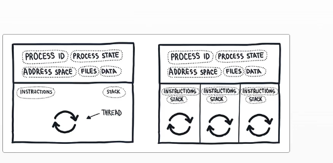
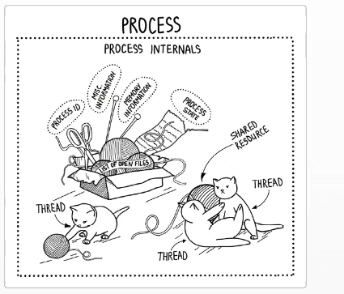

<!-- Imported from: Readme.md -->
### 📖 Chapter IV

- Notes on Chapter IV, covering building blocks of concurrency.

##### 🧱 Building blocks of concurrency

Concurrent programming is a set of abstactins that allow the developer to structure the program  to generate small, independen tasks aps them to the runtime

Process: It is a running program

Process internals: a identifier is called process ID (PID)
Execution context: Encapsulates a lot of things.
Process can create their own processes- using fork or spawn()

A process is a container of resources(address space,files, connections)
A thread is the dynamic part.
a process can be seen as a unit of resources, while a thread can be viewed as a unito of execution.

You can create thread inside the process, here the thread is not sharing data

