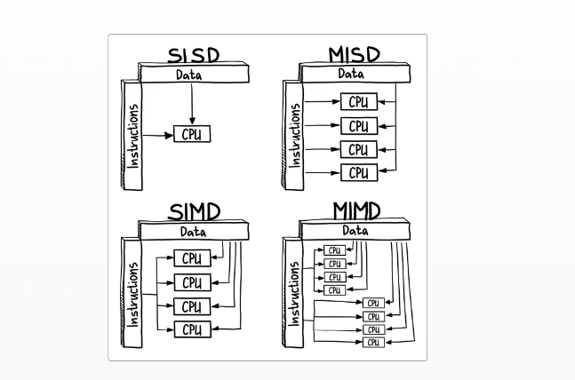

### 📖 Chapter III

- Notes on Chapter III, covering how computer works.

##### How computer works

CPU= CU + ALU
Cache= temporary memory on the CPU. 

##### Recap

- Execution depends on the actual hardware. Modern hardware has multiple processing resources - multiple cores, multirprocesorr or computer clusters
and they are optimized for exeucting programs.

- Flynn's taxonomy describes four types of architecture based on whether the system processes single or multiple instruction at a time (SI or MI)
and whether each instruction acts on single or multiple blocks of data (SD or MD)

- A GPU is an example of SIMD architecture.It's optimized for highly parallel task execution.

- Modern multiprocessors and multicore processors are examples of MIMD. They are far more complex because they[ re multipurpose.

- The processor or CPU is the brain of the computer system, but it's difficult to work with directly. In programming, and additional level of abstraction
is introducided between the application and the system: the runtime system.
